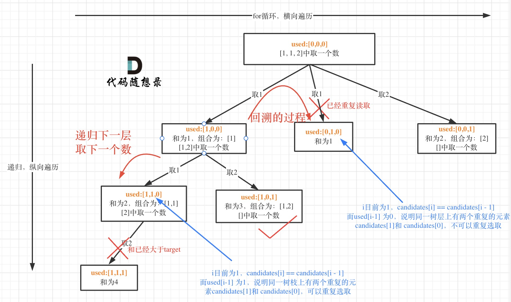

# LeetCode Day22 Backtracking


[77. Combinations](https://leetcode.com/problems/combinations/)

```python
class Solution:
    def combine(self, n: int, k: int) -> List[List[int]]:
        result = []
        path = []
        startIndex = 1
        self.backtracking(n, k, path, result, startIndex )
        return result

    def backtracking(self, n, k, path, result, startIndex):
        if len(path)==k:
            result.append(path[:])
            return
      # If Add Pruning:   
      # for i in range(startIndex, n+1 - (k-len(path))+1):
        for i in range(startIndex, n+1):
            path.append(i)
            self.backtracking(n, k, path, result, i+1)
            path.pop()

```

```python
class Solution:
    def combine(self, n: int, k: int) -> List[List[int]]:
        result = []
        path = []
        startIndex = 1
        
        def backtracking(startIndex):
            if len(path)==k:
                result.append(path[:])
                return
            for i in range(startIndex, n+1):
                path.append(i)
                backtracking(i+1)
                path.pop()
                
        backtracking(startIndex)
        return result
```


Mistake I met:

when I append path to result, why all things in res is empty? But res.append(path[:]) will work.

The issue you're facing stems from how **mutable objects** like lists work in Python. When you append `path` directly to `res`, you're appending a **reference** to the same list, rather than a copy of the list. This means that any subsequent changes to `path` will be reflected in all the elements of `res` that reference the same list. However, when you use `path[:]` (or `path.copy()`), you're appending a **shallow copy** of the list, which breaks the reference and keeps each appended version of `path` separate from future changes.


[216. Combination Sum III](https://leetcode.com/problems/combination-sum-iii/)

Similar with the last one, just one more restriction.

```python
class Solution:
    def combinationSum3(self, k: int, n: int) -> List[List[int]]:
        res = []
        path = []
        startIndex = 1
        def bactracking(startIndex):
            if len(path)==k:
                if sum(path)==n:
                    res.append(path[:])
                return
            for i in range(startIndex, 10-(k-len(path))+1):
                path.append(i)
                bactracking(i+1)
                path.pop()
        bactracking(startIndex)
        return res
```


Another vision with more pruning.

```python
class Solution:
    def combinationSum3(self, k: int, n: int) -> List[List[int]]:
        result = []  
        self.backtracking(n, k, 0, 1, [], result)
        return result

    def backtracking(self, targetSum, k, currentSum, startIndex, path, result):
        if currentSum > targetSum:  # 剪枝
            return 
        if len(path) == k:
            if currentSum == targetSum:
                result.append(path[:])
            return
        for i in range(startIndex, 9 - (k - len(path)) + 2):  # 剪枝
            currentSum += i  # 处理
            path.append(i)  # 处理
            self.backtracking(targetSum, k, currentSum, i + 1, path, result)
            currentSum -= i  # 回溯
            path.pop()  # 回溯
```


[17. Letter Combinations of a Phone Number](https://leetcode.com/problems/letter-combinations-of-a-phone-number/)

```python
class Solution:
    def letterCombinations(self, digits: str) -> List[str]:
        letters = {2:'abc', 3:'def', 4:'ghi', 5:'jkl', 6:'mno', 7:'pqrs', 8:'tuv', 9:'wxyz'}
        res = []
        path = []

        if len(digits)==0:
            return res

        def backtracking(index):
            if index==len(digits):
                res.append(''.join(path[:]))
                return
            digit = int(digits[index])
            letter = letters[digit]
            for i in range(0, len(letter)):
                path.append(letter[i])
                backtracking(index+1)
                path.pop()

        backtracking(0)
        return res        
```

Hide backtracking in parameter:

```python
class Solution:
    def letterCombinations(self, digits: str) -> List[str]:
        letters = {2:'abc', 3:'def', 4:'ghi', 5:'jkl', 6:'mno', 7:'pqrs', 8:'tuv', 9:'wxyz'}
        res = []

        if len(digits)==0:
            return res

        def backtracking(index, s):
            if index==len(digits):
                res.append(s)
                return
            digit = int(digits[index])
            letter = letters[digit]
            for i in range(0, len(letter)):
                backtracking(index+1, s+letter[i])

        backtracking(0, '')
        return res 
```


[39. Combination Sum](https://leetcode.com/problems/combination-sum/)

```python
class Solution:
    def combinationSum(self, candidates: List[int], target: int) -> List[List[int]]:
        sum = 0
        path = []
        result = []
        def backtracing(candidates, target, path, startIndex, sum, result):
            if sum>target:
                return
            if sum == target:
                result.append(path[:])

            for i in range(startIndex, len(candidates)):
                sum += candidates[i]
                path.append(candidates[i])
                backtracing(candidates, target, path, i, sum, result)
                sum -= candidates[i]
                path.pop()
        backtracing(candidates, target, path, 0, sum, result)
        return result
```


[40. Combination Sum II](https://leetcode.com/problems/combination-sum-ii/)

Compared with [216. Combination Sum III](https://leetcode.com/problems/combination-sum-iii/) and 39. Combination Sum, this problem focus on how to make the list in result unique. 



The elements in a single list in the result can be repeated, which is on a vertical level. But the list in the final result cannot be repeated, which needs to be handled by level.

Besides, to handle this by level, we need to sort the candidates first to make it convenient.

```python
class Solution:
    def combinationSum2(self, candidates: List[int], target: int) -> List[List[int]]:
        res = []
        path = []
        startIndex = 0
        candidates.sort()

        def backtracking(startIndex):
            if sum(path)>=target:
                if sum(path)==target:
                    res.append(path[:])
                return
            for i in range(startIndex, len(candidates)):
              # Here, handle repeat answer.
                if i>startIndex and candidates[i]==candidates[i-1]:
                    continue
                path.append(candidates[i])
                backtracking(i+1)
                path.pop()

        backtracking(0)
        return res
```


[131. Palindrome Partitioning](https://leetcode.com/problems/palindrome-partitioning/)

```python
class Solution:
    def partition(self, s: str) -> List[List[str]]:
        result = []
        path = []
        self.backtracing(s, 0, path, result)
        return result
        
    def backtracing(self, s, startIndex, path, result):
        if startIndex == len(s):
            result.append(path[:])
        
        for i in range(startIndex, len(s)):
            if self.isPalindrome((s[startIndex:i+1])):
                path.append((s[startIndex:i+1]))
                self.backtracing(s, i+1, path, result)
                path.pop()
            
    def isPalindrome(self, s):
        for i in range(0, len(s)//2):
            if s[i] != s[len(s) - i - 1]:
                return False
        return True
```


[332. Reconstruct Itinerary](https://leetcode.com/problems/reconstruct-itinerary/)

```python
from collections import defaultdict

class Solution:
    def findItinerary(self, tickets: List[List[str]]) -> List[str]:
        # Create the graph (adjacency list) and sort destinations lexicographically
        flight_map = defaultdict(list)
        for from_, to in sorted(tickets):
            flight_map[from_].append(to)

        res = []

        def dfs(airport):
            while flight_map[airport]:
                # Always get the smallest destination
                next_airport = flight_map[airport].pop(0)
                dfs(next_airport)
            res.append(airport)

        # Start DFS from JFK
        dfs("JFK")
        # The result needs to be reversed, since we are constructing the itinerary backwards
        return res[::-1]
```

