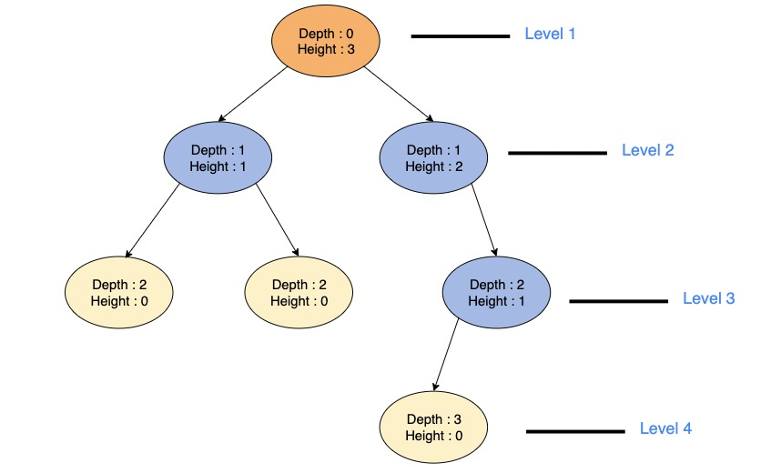

# LeetCode Day13 Binary Tree Basic

## Terminology and Formulas

- **Depth of a node \*n\***: The length of the path from a node *n* to the root node. The depth of the root node is 0.
- **Level of a node \*n\***: (Depth of a Node)+1
- **Height of a node \*n\***: The length of the path from *n* to its deepest descendant. So the height of the tree itself is the height of the root node and the height of leaf nodes is always 0.
- **Height of a Tree**: Height of its root node



Summary: Expect Level, other proporties all count from 0.

## Some Tree Types

- *Binary Trees*
- *Binary Search Trees*
- *AVL Trees*
- *Red-Black Trees*
- *2–3 Trees*

## The N-ary Tree

In graph theory, an N-ary tree is a rooted tree in which each node has no more than N children. It is also sometimes known as a k-way tree, a k-ary tree, or an M-ary tree. A binary tree is a special case where k=2, so they can have a maximum of **2** child nodes and a minimum of **0** child nodes.

## Balanced Tree

∣*Height*(*LeftSubTree*) − *Height*(*RightSubTree*)∣ <= 1

Question: Algorithm to determin a Balanced tree?

## Binary Tree

A ***complete binary tree*** is a binary tree in which all the levels of the tree are fully filled, except for perhaps the last level which can be filled from left to right.

***Full Binary Trees***

- In a full or ‘proper’ binary tree, every node has **0** or **2** children. No node can have 1 child.
- The total number of nodes in a full binary tree of height ‘**h**’ can be expressed as:


**Perfect Binary Trees**

- A Binary tree is said to be **Perfect** if all its internal nodes have two children and all leaves are at the same level. Also, note that:
  - the total number of nodes in a perfect binary tree of height **‘h’** are given as: $2^{(h+1)}−1$
  - the total number of leaf nodes are given as $2^n$ or $\frac{(n+1)}{2}$

- The total number of nodes, n*n*, in a complete binary tree of height **“h”** are: $2^{h}≤nodes≤2^{h+1}−1$. This is again based on the [Geometric Series](https://en.wikipedia.org/wiki/1_%2B_2_%2B_4_%2B_8_%2B_⋯) formula: $2^{0}+2^{1}+2^{3}...+2^{r} =2^{r+1}−1$

***Skewed Binary Trees*** are Binary trees such that all the nodes except one have one and only one child. All of the children nodes are either left or right child nodes so the entire tree is positioned to the left or the right side. This type of Binary Tree structure should be avoided at all costs because the time complexity of most operations will be high.

The two types of Skewed Binary Trees are based on which side the tree leans towards. The left-skewed binary tree has all left child nodes.

## Binary Search Tree (BST)

Binary Search Trees (BSTs) are a special kind of binary tree where each node of the tree has key-value pairs. For all the nodes in a BST, the values of all the keys in the left sub-tree of the node are less than the value of the nodes themselves. All the keys in the right subtree are greater than the values of the node. This is referred to as the BST rule.

### Implementing a Binary Search Tree in Python

`Node` Class:

```python
class Node:
    def __init__(self, val):  # Constructor to initialize the value of the node
        self.val = val
        self.leftChild = None  # Sets the left and right children to `None`
        self.rightChild = None
        self.parent = None  # Sets the parent to `None`
```

The `BinarySearchTree` class

```python
class BinarySearchTree:
    def __init__(self, val):  # Initializes a root node
        self.root = Node(val)
```

#### Binary Search Tree Insertion (Implementation)

There are two ways to code a BST insert function

- *Iteratively*
- *Recursively*

> The `Node` class’s `insert()` function takes care of the meat of the algorithm. Now, while you *can* write an insert function in the `BinarySearchTree` class itself, it’s better to write it as part of the `Node` class as it *usually* makes the code cleaner and easier to maintain.

While traversing, it stores the parent node of each current node and when the current node becomes empty or `None`, it inserts the value there.

```python
class Node:
    def __init__(self, val):
        self.val = val
        self.leftChild = None
        self.rightChild = None
        
    # Iterative
    def insert(self, val):
        current = self
        parent = None
        while current:
            parent = current
            if val < current.val:
                current = current.leftChild
            else:
                current = current.rightChild

        if(val < parent.val):
            parent.leftChild = Node(val)
        else:
            parent.rightChild = Node(val)

    # Recursive
    def insert(self, val):
        if val < self.val:
            if self.leftChild:
                self.leftChild.insert(val)
            else:
                self.leftChild = Node(val)
                return
        else:
            if self.rightChild:
                self.rightChild.insert(val)
            else:
                self.rightChild = Node(val)
                return
```

```python
class BinarySearchTree:
    def __init__(self, val):
        self.root = Node(val)

    def insert(self, val):
        if self.root:
            return self.root.insert(val)
        else:
            self.root = Node(val)
            return True
```


Other basic operations:

Search, Deletion, traversal. 

### Deletion

For deletion, we can separate the cases into 3 categories.

1. Deleting a leaf node.
2. Deleting a node which has one child only
   1. Deleting a node which has a right child only
   2. Deleting a node which has a left child only
3. Deleting a node with two children

Deleting a leaf node is easy, just search to find the node and make it None. 

Deleting a node which has one child only. We search for the node, once the node is found we check if and how many children it has. If it has only one child, we check the parent node to see if the current node is the left or right child and then replace its child node with the current node. 

Deleting a node with two children is the most challenged case. From the given node to be deleted, find either <u>the node with the **smallest** value in the **right** sub-tree </u>(inorder successor) or <u>the node with the **largest** value in the **left** sub-tree.</u> 

Replace the node to be deleted with the node found (the smallest node in the right sub-tree or the largest node in the left sub-tree).

Finally, delete the node found (the smallest in the right sub-tree).

```python
class Node:
    def __init__(self, val):
        self.val = val
        self.leftChild = None
        self.rightChild = None

    def insert(self, val):
        if val < self.val:
            if self.leftChild:
                self.leftChild.insert(val)
            else:
                self.leftChild = Node(val)
                return
        else:
            if self.rightChild:
                self.rightChild.insert(val)
            else:
                self.rightChild = Node(val)
                return

    def search(self, val):
        if val < self.val:
            if self.leftChild:
                return self.leftChild.search(val)
            else:
                return False
        elif val > self.val:
            if self.rightChild:
                return self.rightChild.search(val)
            else:
                return False
        else:
            return True
        return False

    def delete(self, val):
        # if current node's val is less than that of root node,
        # then only search in left subtree otherwise right subtree
        if val < self.val:
            if(self.leftChild):
                self.leftChild = self.leftChild.delete(val)
            else:
                print(str(val) + " not found in the tree")
                return self
        elif val > self.val:
            if(self.rightChild):
                self.rightChild = self.rightChild.delete(val)
            else:
                print(str(val) + " not found in the tree")
                return self
        else:
            # deleting node with no children
            if self.leftChild is None and self.rightChild is None:
                self = None
                return None
            # deleting node with right child
            elif self.leftChild is None:
                tmp = self.rightChild
                self = None
                return tmp
            # deleting node with left child
            elif self.rightChild is None:
                tmp = self.leftChild
                self = None
                return tmp
            # deleting node with two children
            else:
                # first get the inorder successor
                current = self.rightChild
                # loop down to find the leftmost leaf
                while(current.leftChild is not None):
                    current = current.leftChild
                self.val = current.val
                self.rightChild = self.rightChild.delete(current.val)

        return self

```

### Traversal

Pre-order, Post-order and In-order.

```python
def preOrderPrint(node):
    if node is not None:
        print(node.val)
        preOrderPrint(node.leftChild)
        preOrderPrint(node.rightChild)
   
def postOrderPrint(node):
    if node is not None:
        postOrderPrint(node.leftChild)
        postOrderPrint(node.rightChild)
        print(node.val)
    
def inOrderPrint(node):
    if node is not None:
        inOrderPrint(node.leftChild)
        print(node.val)
        inOrderPrint(node.rightChild)
```


## Leetcode

[144. Binary Tree Preorder Traversal](https://leetcode.com/problems/binary-tree-preorder-traversal/)

[94. Binary Tree Inorder Traversal](https://leetcode.com/problems/binary-tree-inorder-traversal/)

[145. Binary Tree Postorder Traversal](https://leetcode.com/problems/binary-tree-postorder-traversal/)

```python
# Definition for a binary tree node.
# class TreeNode:
#     def __init__(self, val=0, left=None, right=None):
#         self.val = val
#         self.left = left
#         self.right = right
class Solution:

    def traversal(self, root, res):
        if root == None:
            return None
        res.append(root.val)
        self.traversal(root.left,res)
        self.traversal(root.right,res)

    def preorderTraversal(self, root: Optional[TreeNode]) -> List[int]:
        res = []
        self.traversal(root, res)
        return res
```


### Iterative Solution of Traversal

Preorder Traversal

```python
class Solution:
    def preorderTraversal(self, root: Optional[TreeNode]) -> List[int]:
        stack = []
        res = []
        if (root==None):
            return res
        
        stack.append(root)
        while stack:
            node = stack[-1]
            stack.pop()
            res.append(node.val)
            if node.right:
                stack.append(node.right)
            if node.left:
                stack.append(node.left)
        return res

```


Inorder Traversal

```python
class Solution:
   def inorderTraversal(self, root: Optional[TreeNode]) -> List[int]:       
        stack = []
        res = []

        cur = root
        while cur!=None or stack:
            if cur:
                stack.append(cur)
                cur = cur.left
            else:
                cur = stack[-1]
                stack.pop()
                res.append(cur.val)
                cur = cur.right
        return res
```


Postorder

```python
class Solution:
    def postorderTraversal(self, root: Optional[TreeNode]) -> List[int]:
        stack = []
        res = []
        if (root==None):
            return res
        
        stack.append(root)
        while stack:
            node = stack[-1]
            stack.pop()
            res.append(node.val)
            if node.left:
                stack.append(node.left)
            if node.right:
                stack.append(node.right)
        res.reverse()   
        return res
```

> List's reverse() method seems similar with string's reversed(). But reverse() is a list method, while reversed() is a built-in function can be used with any iterable.


Unified Iterative Solution of Traversal

The above three iteration methods are different and not unified. If a stack is used in the in-order traversal, it is impossible to solve the inconsistency between accessing nodes (traversing nodes) and processing nodes (putting elements into the result set) at the same time.

Then we put the accessed nodes into the stack, and put the nodes to be processed into the stack, but mark them.

How it works:

1. When a node is first encountered (visited), it is pushed onto the stack along with a **marker** (such as a `None` pointer) that indicates the node needs to be processed later.
2. After finishing traversal of its left subtree, when the node is popped from the stack, the marker tells the algorithm to process the node (i.e., add it to the result).
3. This allows the algorithm to clearly separate the **traversal** (going through nodes) from the **processing** (adding nodes to the result) stages.

```python
class Solution:
    def inorderTraversal(self, root: TreeNode) -> List[int]:
        result = []
        st = []
        if root:
            st.append(root)
        while st:
            for i in st:
                if i:
                    print(i.val , end = ' ')
                else:
                    print(i, end = ' ')
            print()
            node = st.pop()
            if node != None:
                if node.right: #添加右节点（空节点不入栈）
                    st.append(node.right)
                
                st.append(node) #添加中节点
                st.append(None) #中节点访问过，但是还没有处理，加入空节点做为标记。
                
                if node.left: #添加左节点（空节点不入栈）
                    st.append(node.left)
            else: #只有遇到空节点的时候，才将下一个节点放进结果集
                node = st.pop() #重新取出栈中元素
                result.append(node.val) #加入到结果集
        return result
```


### [102. Binary Tree Level Order Traversal](https://leetcode.com/problems/binary-tree-level-order-traversal/)

For Level Order Traversal, instead of using a stack, we use a queue, which operates on the principle of first in, first out (FIFO).

Each time a node is dequeued, we add its left and right children to the queue.

But how do we separate the levels?

In fact, during the while loop, each iteration represents a new level. Within each iteration, we use a `for` loop to go through all the elements in the queue. These elements belong to the same level, and their children belong to the next level. So, in fact, we pop out all nodes on current level and push in all nodes on the next level.

```python
from collections import deque

class Solution:
    def levelOrder(self, root: Optional[TreeNode]) -> List[List[int]]:
        if not root:
            return []
        que = deque([])
        que.append(root)
        res = []
        while que:
            level = []

            for i in range(len(que)):
                cur = que.popleft()
                level.append(cur.val)
                if cur.left:
                    que.append(cur.left)
                if cur.right:
                    que.append(cur.right)
            res.append(level)
        return res

```

