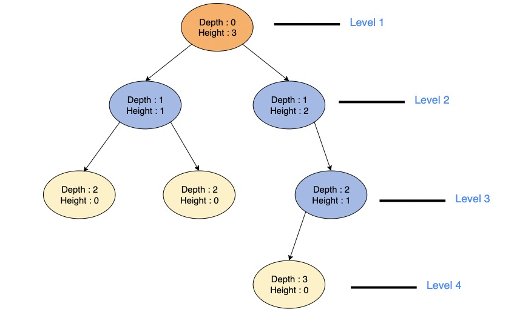

# LeetCode Day14,15,16 Binary Tree Practice


Nearly all problems of Binary Tree can be solved with the logic of traversal. Either pre-order, in-order, post-order or level order. 

And all traversal methods can be implemented recusively or iteratively. It's nice practice to think about whether other approaches are feasible while we using the most understandable method to solve the problem.


###### [226. Invert Binary Tree](https://leetcode.com/problems/invert-binary-tree/)

```python
class Solution:
    def invertTree(self, root: TreeNode) -> TreeNode:
        if not root:
            return None
        root.left, root.right = root.right, root.left
        self.invertTree(root.left)
        self.invertTree(root.right)
        return root
```

###### [101. Symmetric Tree](https://leetcode.com/problems/symmetric-tree/)

```python
class Solution:
    def isSymmetric(self, root: Optional[TreeNode]) -> bool:
        return self.compare(root.left, root.right)
    
    def compare(self, left, right):
        if left and right and left.val==right.val and self.compare(left.left, right.right) and self.compare(left.right, right.left):
            return True
        if not left and not right:
            return True
        return False
```


###### [104. Maximum Depth of Binary Tree](https://leetcode.com/problems/maximum-depth-of-binary-tree/)

Recursively get the maxDepth of current node' sub-trees. Pick the bigger depth and add one to get the current node's maxDepth.

Recall the depth and height of a tree, depth count from top(root) to bottom(leaf), height count from bottom to top. 



Root node has depth of 0, but it's height is the max depth of the whole tree. Therefore, we are also solving the height of root. 

All nodes on the same level have the same depth, but not always have the same height, because head count from leaf.

Under the code, there's the logic of post-order, because we first need to know the maxDepth of left sub-tree and right sub-tree, pick the bigger one, then finally calculate for the root node.

```python
class Solution:
    def maxDepth(self, root: Optional[TreeNode]) -> int:
        if not root:
            return 0
        return max(self.maxDepth(root.left), self.maxDepth(root.right))+1
```

So, when solving the height of root, we use post-order traversal, paired with the next question, let's see what should we use. 

###### [111. Minimum Depth of Binary Tree](https://leetcode.com/problems/minimum-depth-of-binary-tree/)

Recursively get the minimum height of root's sub-trees. However, what if the node only have one subtree? We can not simple pick the minimun which is 0!

```python
class Solution:
    def minDepth(self, root: Optional[TreeNode]) -> int:
        if not root:
            return 0
        if root.left and not root.right:
            return self.minDepth(root.left) + 1
        if root.right and not root.left:
            return self.minDepth(root.right) + 1
        left_depth = self.minDepth(root.left)
        right_depth = self.minDepth(root.right)
        return min(left_depth, right_depth)+1
        
```


###### [110. Balanced Binary Tree](https://leetcode.com/problems/balanced-binary-tree/)

For this problem, we will need the height of a tree. We def a function take a node and return the height of current node. But how to mark whether the difference of heights of left and right subtress bigger than one? 

If the tree based on the node is already not balanced, we don't need to slove the height again, therefore we can return -1 indicating it has break the balance.

How to determine whether the binary tree with the current incoming node as the root node is a balanced binary tree? Of course, it is the difference between the height of its left subtree and the height of its right subtree.

Calculate the height of its left and right subtrees respectively, and then if the difference is less than or equal to 1, return the height of the current binary tree, otherwise return -1, indicating that it is no longer a binary balanced tree.

```python
class Solution:
    def isBalanced(self, root: Optional[TreeNode]) -> bool:
        return self.checkHeight(root) != -1

    def checkHeight(self, root):
        if not root:
            return 0
        
        left_height = self.checkHeight(root.left)
        if left_height == -1:
            return -1  # Left subtree is not balanced
        
        right_height = self.checkHeight(root.right)
        if right_height == -1:
            return -1  # Right subtree is not balanced
        
        if abs(left_height - right_height) > 1:
            return -1  # Current tree is not balanced
        
        return max(left_height, right_height) + 1

```


###### [257. Binary Tree Paths](https://leetcode.com/problems/binary-tree-paths/)

Backtracing

```python
class Solution:
    def binaryTreePaths(self, root: Optional[TreeNode]) -> List[str]:
        result = []
        path = []
        if not root:
            return result
        self.traversal(root, path, result)
        return result
    
    def traversal(self, cur, path, res):
        path.append(str(cur.val))
        if not cur.left and not cur.right:
            res.append('->'.join(path))
            return
        if cur.left:
            self.traversal(cur.left, path, res)
            path.pop()
        if cur.right:
            self.traversal(cur.right, path, res)
            path.pop()
```


The underlying logic is pre-order traversal. Because we need the parent node shows up first.


If we pass `path + '->'` as a parameter, the `path` itself won't be changed. 

```python
class Solution:
    def binaryTreePaths(self, root: TreeNode) -> List[str]:
        path = ''
        result = []
        if not root: return result
        self.traversal(root, path, result)
        return result
    
    def traversal(self, cur: TreeNode, path: str, result: List[str]) -> None:
        path += str(cur.val)
        # 若当前节点为leave，直接输出
        if not cur.left and not cur.right:
            result.append(path)

        if cur.left:
            # + '->' 是隐藏回溯
            self.traversal(cur.left, path + '->', result)
        
        if cur.right:
            self.traversal(cur.right, path + '->', result)
```


###### [404. Sum of Left Leaves](https://leetcode.com/problems/sum-of-left-leaves/)

```python
# Definition for a binary tree node.
# class TreeNode:
#     def __init__(self, val=0, left=None, right=None):
#         self.val = val
#         self.left = left
#         self.right = right
class Solution:
    def sumOfLeftLeaves(self, root: Optional[TreeNode]) -> int:
        if not root:
            return 0
        return self.checkSumLeftLeaves(root)
    def checkSumLeftLeaves(self,root):
        if not root:
            return 0
        sum = self.checkSumLeftLeaves(root.left)+self.checkSumLeftLeaves(root.right)
        if root.left and not root.left.left and not root.left.right:
            sum += root.left.val
        return sum
```


###### [222. Count Complete Tree Nodes](https://leetcode.com/problems/count-complete-tree-nodes/)

It's still the logic of post-order traversal

```python
class Solution:
    def countNodes(self, root: Optional[TreeNode]) -> int:
        if not root:
            return 0
        return self.countNodes(root.left)+self.countNodes(root.right)+1
```


###### [513. Find Bottom Left Tree Value](https://leetcode.com/problems/find-bottom-left-tree-value/)

```python
from collections import deque
class Solution:
    def findBottomLeftValue(self, root: Optional[TreeNode]) -> int:
        if not root: return 0
        que = deque([])
        que.append(root)
        res = 0

        while que:
            for i in range(len(que)):
                cur = que.popleft()
                if i==0:
                    res = cur.val
                if cur.left:
                    que.append(cur.left)
                if cur.right:
                    que.append(cur.right)

        return res

```


###### [112. Path Sum](https://leetcode.com/problems/path-sum/)

```python
class Solution:
    def hasPathSum(self, root: Optional[TreeNode], targetSum: int) -> bool:
        if not root:
            return False
        if not root.left and not root.right:
            return targetSum-root.val==0
        return self.hasPathSum(root.left, targetSum-root.val) or self.hasPathSum(root.right, targetSum-root.val)
        
```


###### [113. Path Sum II](https://leetcode.com/problems/path-sum-ii/)

```python
class Solution:
    def pathSum(self, root: TreeNode, targetSum: int) -> List[List[int]]:
        
        result = []
        self.traversal(root, targetSum, [], result)
        return result
    def traversal(self, node, count, path, result):
        if not node:
            return
        path.append(node.val)
        count -= node.val
        if not node.left and not node.right and count == 0:
            result.append(list(path))
        self.traversal(node.left, count, path, result)
        self.traversal(node.right, count, path, result)
        path.pop()
```


###### [106. Construct Binary Tree from Inorder and Postorder Traversal](https://leetcode.com/problems/construct-binary-tree-from-inorder-and-postorder-traversal/)

```python
class Solution:
    def buildTree(self, inorder: List[int], postorder: List[int]) -> Optional[TreeNode]:
        if not inorder:
            return None

        root_val = postorder[-1]
        root = TreeNode(root_val)

        root_index_in = inorder.index(root_val)

        left_inorder = inorder[:root_index_in]
        right_inorder = inorder[root_index_in+1:]
        
        left_postorder = postorder[:root_index_in]
        right_postorder = postorder[root_index_in:-1] 
        
        root.left = self.buildTree(left_inorder, left_postorder)
        root.right = self.buildTree(right_inorder, right_postorder)
        return root
```


optimized by GPT

```python
class Solution:
    def buildTree(self, inorder: List[int], postorder: List[int]) -> Optional[TreeNode]:
        # Create a hashmap to store value -> index mappings for inorder
        inorder_index_map = {val: idx for idx, val in enumerate(inorder)}

        # Helper function to build the tree using index boundaries
        def helper(in_left, in_right, post_left, post_right):
            if in_left > in_right:
                return None

            # The last element of postorder is the root of the current subtree
            root_val = postorder[post_right]
            root = TreeNode(root_val)

            # Get the index of the root from the hashmap
            root_index_in = inorder_index_map[root_val]

            # Number of nodes in the left subtree
            left_subtree_size = root_index_in - in_left

            # Recursively build the left and right subtrees
            root.left = helper(in_left, root_index_in - 1, post_left, post_left + left_subtree_size - 1)
            root.right = helper(root_index_in + 1, in_right, post_left + left_subtree_size, post_right - 1)

            return root

        # Initialize the helper with the full range of indices
        return helper(0, len(inorder) - 1, 0, len(postorder) - 1)

```

You can improve performance by:

1. **Using a hash map** to store the indices of elements in the `inorder` list, which allows O(1)O(1)O(1) access to the index of each element.
2. **Avoiding list slicing** by using index boundaries instead of creating new lists during recursion.


> A binart tree can be constructed with it's in-order traversal and it's post/pre-order traversal. But not it's post and pre-order traversal.


###### [654. Maximum Binary Tree](https://leetcode.com/problems/maximum-binary-tree/)

```python
class Solution:
    def constructMaximumBinaryTree(self, nums: List[int]) -> Optional[TreeNode]:
        if not nums:
            return None
        root = TreeNode(max(nums))
        largest_index = nums.index(max(nums))
        root.left = self.constructMaximumBinaryTree(nums[:largest_index])
        root.right = self.constructMaximumBinaryTree(nums[largest_index+1:])
        return root
```


###### [617. Merge Two Binary Trees](https://leetcode.com/problems/merge-two-binary-trees/)

```python
class Solution:
    def mergeTrees(self, root1: Optional[TreeNode], root2: Optional[TreeNode]) -> Optional[TreeNode]:
        if not root1:
            return root2
        if not root2:
            return root1
        root = TreeNode(root1.val+ root2.val)

        root.left = self.mergeTrees(root1.left, root2.left)
        root.right = self.mergeTrees(root1.right, root2.right)
        return root
```

