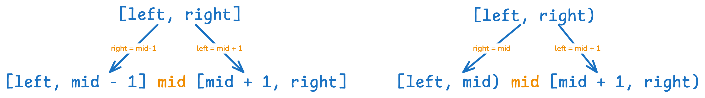

# LeetCode Day 1 Array, Binary Search


Binary Search could be used to:

1. Find a number
2. Find left border
3. Find right border


The frame

```python
def binarySearch(nums):
  left = 0
  right = ...
  
  while ...:
    mid = (left+right)//2
    if nums[mid] == target:
      ...
    elif nums[mid] < target:
      ...
    elif nums[mid] > target:
      ...
  return ...
    
```

If not using Python, use `mid = left + (right-left)/2` instead of `mid = (left+right)/2` to prevent overflow.

In this frame, we need to decide, whether there is `left < right` or `left <= right` after while? And how to update `right` or `left` in the if/else statement? 


Let we dive into first conditiom, find a number: 


 [704. Binary Search](https://leetcode.com/problems/binary-search/)


```python
class Solution:
    def search(self, nums: List[int], target: int) -> int:
        left = 0
        right = len(nums) 
        while left<right:
            middle = (left+right)//2
            if nums[middle] > target:
                right = middle
            elif nums[middle] < target:
                left = middle + 1
            else: return middle
        return -1
```


```python
class Solution:
    def search(self, nums: List[int], target: int) -> int:
        left = 0
        right = len(nums) - 1
        while left<=right:
            middle = (left+right)//2
            if nums[middle] > target:
                right = middle - 1
            elif nums[middle] < target:
                left = middle + 1
            else: return middle
        return -1
```


When `while left<right`, the terminate condition is `left = right`, 

| Interval Define | While loop          | If not found, Terminate condition | Update when nums[middle] > target |
| --------------- | ------------------- | --------------------------------- | --------------------------------- |
| [left, right]   | while left <= right | left = right + 1                  | right = middle - 1                |
| [left, right)   | while left < right  | left = right                      | right = middle                    |





[34. Find First and Last Position of Element in Sorted Array](https://leetcode.com/problems/find-first-and-last-position-of-element-in-sorted-array/)


2 Version of solution.


```python
class Solution:
    def searchRange(self, nums: List[int], target: int) -> List[int]:
        def searchLeft():
            left = 0
            right = len(nums) - 1 
            while left <= right:
                middle = (left + right) // 2
                if nums[middle] > target:
                    right = middle - 1
                elif nums[middle] < target:
                    left = middle + 1
                elif nums[middle] == target: 
                    right = middle - 1
            return right

        def searchRight():
            left = 0
            right = len(nums) - 1 
            while left <= right:
                middle = (left + right) // 2
                if nums[middle] > target:
                    right = middle - 1
                elif nums[middle] < target:
                    left = middle + 1
                elif nums[middle] == target: 
                    left = middle + 1
            return left
        
        left = searchLeft() + 1
        right = searchRight() - 1
        if left>right: 
            return [-1,-1]
        else:
            return [left, right]
```
  
```python
class Solution:
    def searchRange(self, nums: List[int], target: int) -> List[int]:
        def searchLeft():
            left = 0
            right = len(nums) 
            while left < right:
                middle = (left + right) // 2
                if nums[middle] > target:
                    right = middle 
                elif nums[middle] < target:
                    left = middle + 1
                elif nums[middle] == target: 
                    right = middle
            return right
            
        def searchRight():
            left = 0
            right = len(nums) 
            while left < right:
                middle = (left + right) // 2
                if nums[middle] > target:
                    right = middle 
                elif nums[middle] < target:
                    left = middle + 1
                elif nums[middle] == target: 
                    left = middle + 1
            return left
        
        left = searchLeft()
        right = searchRight() - 1
        if left>right: 
            return [-1,-1]
        else:
            return [left, right]
```


Time Complexity: O(n)

Space Complexity: O(1)
