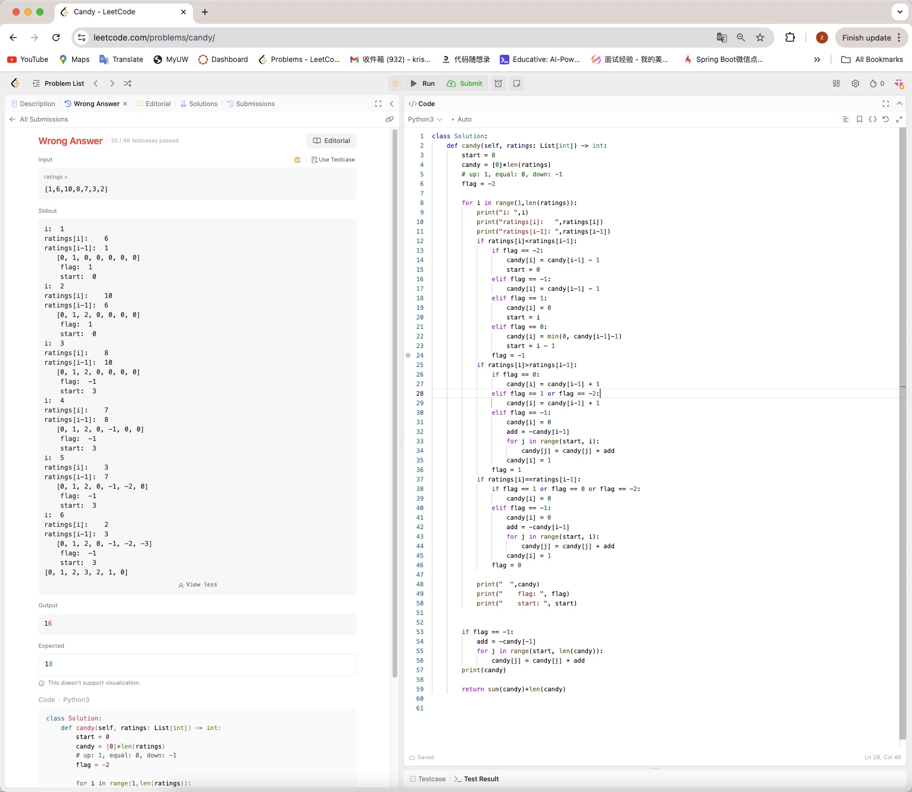

# LeetCode Day29,30 Greedy Part 2


### [134. Gas Station](https://leetcode.com/problems/gas-station/)

Approach 1: Broute Force (Time Limits Exceeded)

```python
class Solution:
    def canCompleteCircuit(self, gas: List[int], cost: List[int]) -> int:
        remain = [a-b for a,b in zip(gas, cost)]

        for i in range(len(gas)):
            sum = 0
            for j in range(len(gas)):
                sum += remain[(i+j)%len(gas)]
                if sum < 0:
                    break
                if j == len(gas) - 1:
                    return i 
        return -1
```


Approach 2: Greedy

What we can deduce:

1. If the sum of `gas` is smaller than the sum of `cost`, we can not finish a circular route anyway.
2. If the sum of `gas` is not smaller than the sum of `cost`, we must can find a start able to finish  a circular route.

3. Calculate from the start, if our remain gas (`cur_sum`) is smaller than zero, then this start station is not a solution. **But besides this**, we can know **all stations form the start station to current station** won't be a solution. 

   Therefore, we can start from the next gas station of current station. Do this until the end of the for loop, we can must find a solution (because we have already verify there must be a solution by 2).

```python
class Solution:
    def canCompleteCircuit(self, gas: List[int], cost: List[int]) -> int:
        remain = [a-b for a,b in zip(gas, cost)]
        if sum(remain)<0:
            return -1

        start = 0
        cur_sum = 0
        for i in range(len(gas)):
            cur_sum += remain[i]

            if cur_sum < 0:
                start = i + 1
                cur_sum = 0
        
        return start
```


### [135. Candy](https://leetcode.com/problems/candy/)

The number of candies for each child needs to take into account the scores of the children on both sides, so it is difficult to solve this problem by only traversing from front to back. This is the mistake I made. I spent an hour trying to observe the monotonicity law to solve the problem, constantly correcting it, and finally found that I still missed a situation. 

Because it needs to be compared with the "neighbors", the comparison of each element is "bidirectional", so traversing in one direction cannot solve the problem.



But we can easily get the answer if we traverse the list from head to end and then end to head!

```python
class Solution:
    def candy(self, ratings: List[int]) -> int:
        start = 0
        candy = [1]*len(ratings)

        for i in range(1, len(ratings)):
            if ratings[i]>ratings[i-1]:
                candy[i] = candy[i-1] + 1
        
        for i in range(len(ratings)-1, 0, -1):
            if ratings[i-1]>ratings[i] and candy[i-1]<=candy[i]:
                candy[i-1] = candy[i] + 1
                
        return sum(candy)
```

Note:

If you want to use for loop with decreasing index, use `range(a,  b, -1)`. But `a` is bigger than `b`. Still obay the left-close right-open convention.

Time Complexity: O(n)

Space Complexity: O(n)

Note: More solution on Leetcode, with Time Complexity O(n) and Space Complexity O(1). <mark>Check back</mark>

https://leetcode.com/problems/candy/editorial/


### [860. Lemonade Change](https://leetcode.com/problems/lemonade-change/)

Easy, skip.

### [406. Queue Reconstruction by Height](https://leetcode.com/problems/queue-reconstruction-by-height/)

妙

```python
class Solution:
    def reconstructQueue(self, people: List[List[int]]) -> List[List[int]]:
        people.sort(key=lambda x: (-x[0], x[1]))
        res = []
 
        for p in people:
            res.insert(p[1], p)
        return res
```


## Overlapping intervals problem

### [452. Minimum Number of Arrows to Burst Balloons](https://leetcode.com/problems/minimum-number-of-arrows-to-burst-balloons/)


### [435. Non-overlapping Intervals](https://leetcode.com/problems/non-overlapping-intervals/)


### [736. Parse Lisp Expression](https://leetcode.com/problems/parse-lisp-expression/)
