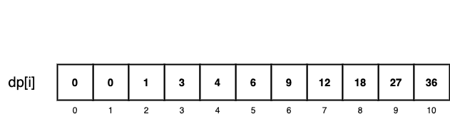

# LeetCode Day 32,33 Dynamic Programming

Dynamic Programming Step:

1. Determine the dp array and the meaning of it's index
2. Determine the induction fomular
3. Initialize the dp array
4. Determine the order of traversal
5. Make example and try deduct the dp array


### [509. Fibonacci Number](https://leetcode.com/problems/fibonacci-number/)

Approach 1: DP

```python
class Solution:
    def fib(self, n: int) -> int:
        if n <= 1: return n
        dp = [0]*(n+1)
        dp[0] = 0
        dp[1] = 1
        for i in range(2, n+1):
            dp[i] = dp[i-1] + dp[i-2]
        return dp[n]
```

Time Complexity: O(n)

Approach 2: Recursion

```python
class Solution:
    def fib(self, n: int) -> int:
        if n==0: return 0
        if n==1: return 1

        return self.fib(n-1)+self.fib(n-2)
```

Time Complexity: O(2^n)

### [70. Climbing Stairs](https://leetcode.com/problems/climbing-stairs/)

```python
class Solution:
    def climbStairs(self, n: int) -> int:
        if n == 1 :
            return 1

        dp = [0]*(n+1)
        dp[1] = 1
        dp[2] = 2
        for x in range(3, n+1):
            dp[x] = dp[x-2] + dp[x-1]
        return dp[n]
```

### [746. Min Cost Climbing Stairs](https://leetcode.com/problems/min-cost-climbing-stairs/)

```python
class Solution:
    def minCostClimbingStairs(self, cost: List[int]) -> int:
        dp = [0] * len(cost)
        dp[0] = cost[0]
        dp[1] = cost[1]
        for x in range(2, len(cost)):
            dp[x] = min(dp[x-1], dp[x-2]) + cost[x]
        return min(dp[len(cost)-1], dp[len(cost)-2])
```


### [62. Unique Paths](https://leetcode.com/problems/unique-paths/)

#### Use Combination:

```python
class Solution:
    def uniquePaths(self, m: int, n: int) -> int:
        return math.comb(m+n-2, m-1)
```

Note: `math.comb()` method available only >= Python 3.8

#### Dynamic Programming:

```python
class Solution:
    def uniquePaths(self, m: int, n: int) -> int:
        dp = [[0 for i in range(n)] for j in range(m)]
        print(dp)
        dp[0][0] = 0

        for x in range(m): dp[x][0] = 1
        for x in range(n): dp[0][x] = 1

        for x in range(1, m):
            for y in range(1,n ):
                dp[x][y] = dp[x-1][y] + dp[x][y-1]
                
        return dp[m-1][n-1]
```

Time Complexity: O(mn)


### [63. Unique Paths II](https://leetcode.com/problems/unique-paths-ii/)

Add obstacles compared with last problem. Just need to set `dp` of the obstacles position to 0.

```python
class Solution:
    def uniquePathsWithObstacles(self, obstacleGrid: List[List[int]]) -> int:
        m = len(obstacleGrid)
        n = len(obstacleGrid[0])
        
        dp = [[0 for i in range(n)] for j in range(m)]
        dp[0][0] = 0

        for x in range(m): 
            if obstacleGrid[x][0] == 0:
                dp[x][0] = 1
            else: break
        for x in range(n): 
            if obstacleGrid[0][x] == 0:
                dp[0][x] = 1
            else: break

        for x in range(1, m):
            for y in range(1,n ):
                if obstacleGrid[x][y] == 1: dp[x][y] = 0
                else: dp[x][y] = dp[x-1][y] + dp[x][y-1]
                
        return dp[m-1][n-1]
```


### [343. Integer Break](https://leetcode.com/problems/integer-break/)

`dp[i] = max(dp[i], max((i - j) * j, dp[i - j] * j))`

```python
class Solution:
    def integerBreak(self, n: int) -> int:
        dp = [0]*(n+1)
        dp[2] = 1

        for i in range(3, n + 1):
            for j in range(1 ,i-1):
                dp[i] = max(dp[i], j*(i-j), j*dp[i-j])
        return dp[n]
```



### [96. Unique Binary Search Trees](https://leetcode.com/problems/unique-binary-search-trees/)

Draw when n=1, n=2, n=3. Then we can observe the pattern.

The total number of unique BSTs is the sum of the unique BSTs formed by choosing each number from 0 to nnn as the root.

The number of unique BST's with each number (0, 1, ... n) as the root, is the product of the number unique left sub-tree and the number of unique right sub-tree.

For example, the number of unique BST's with i as the root (when we have n nodes), is the product of the number unique left sub-tree (the solution when n = i-1) and the number of unique right sub-tree(the solution when n = n - i ).


`dp[i] = dp[0]dp[i-1] + dp[1]dp[1-2] + dp[2]dp[i-3] .... +dp[] dp[i-1]dp[0]`

```python
class Solution:
    def numTrees(self, n: int) -> int:
        dp = [0]*(n+1)
        dp[0] = 1

        for i in range(1, n+1):
            for j in range(0,i):
                dp[i] += dp[j]*dp[i-j-1]
        return dp[n]
```


