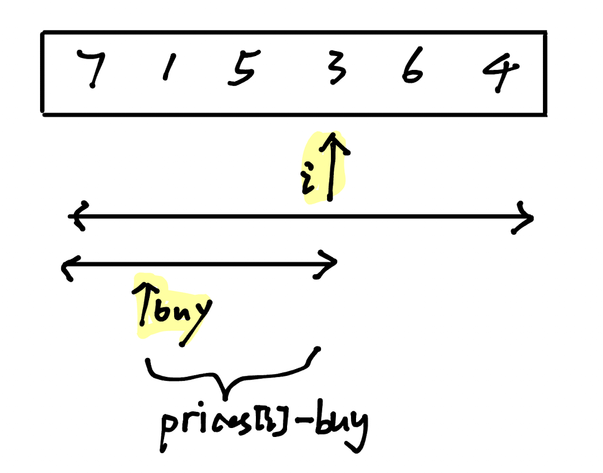

# LeetCode Day 39,40 Dynamic Programming Buy and Sell Stock


| [121. Best Time to Buy and Sell Stock](https://leetcode.com/problems/best-time-to-buy-and-sell-stock/) |      |      |
| ------------------------------------------------------------ | ---- | ---- |
| [122. Best Time to Buy and Sell Stock II](https://leetcode.com/problems/best-time-to-buy-and-sell-stock-ii/) |      |      |
| [123. Best Time to Buy and Sell Stock III](https://leetcode.com/problems/best-time-to-buy-and-sell-stock-iii/) |      |      |
| [188. Best Time to Buy and Sell Stock IV](https://leetcode.com/problems/best-time-to-buy-and-sell-stock-iv/) |      |      |
| [309. Best Time to Buy and Sell Stock with Cooldown](https://leetcode.com/problems/best-time-to-buy-and-sell-stock-with-cooldown/) |      |      |


### [121. Best Time to Buy and Sell Stock](https://leetcode.com/problems/best-time-to-buy-and-sell-stock/)


#### Approach 1: Greedy

```python
class Solution:
    def maxProfit(self, prices: List[int]) -> int:
        low = float("inf")
        result = 0
        for i in range(len(prices)):
            low = min(low, prices[i]) #取最左最小价格
            result = max(result, prices[i] - low) #直接取最大区间利润
        return result
```



#### Approach 2: DP

##### DP List Define:

`dp[i][0]`: max $ if hold a stock on day i

`dp[i][0]`: max $ if hold no stock on day i

##### Recusive Relation:

`dp[i][0]` = `max(dp[i-1][0],-prices[i] )`

- `dp[i-1][0]`: hold a stack on `i-1`, remain the same on day i

- `-prices[i]`: buy a stack on day `i`

`dp[i][1]` = `max(dp[i-1][1], prices[i] + dp[i-1][0])`

- `dp[i-1][1]`: hold no stack on day `i-1`, remain the same

- `prices[i] + dp[i-1][0]`: throw the stack today (day `i`).

##### Initialization:

`dp[0][0]`: Because we hold a stock on day 0, therefore we must buy on day 0, so it will be `-prices[0]`

`dp[0][1]`: No stack on day 0, therefore 0.

```python
class Solution:
    def maxProfit(self, prices: List[int]) -> int:
        dp = [[0,0] for _ in range(len(prices))]
        dp[0][0] = -prices[0]

        for i in range(1, len(prices)):
            dp[i][0] = max(dp[i-1][0], -prices[i])
            dp[i][1] = max(dp[i-1][1], dp[i][0]+prices[i])
        return dp[len(prices) - 1][1]
```


Sum:

Using DP axtually do exactlly the same with greedy. we can see `dp[i][0]` maintain the min to buy, and `dp[i][1]` maintain the `max_profit`.


### [122. Best Time to Buy and Sell Stock II](https://leetcode.com/problems/best-time-to-buy-and-sell-stock-ii/)

#### Approach 1: Greedy

```python
class Solution:
    def maxProfit(self, prices: List[int]) -> int:
        result = 0

        for i in range(1, len(prices)):
            profit = prices[i] - prices[i-1]
            if profit > 0 :
                result += profit

        return result
```

#### Approach 2: DP

```python
class Solution:
    def maxProfit(self, prices: List[int]) -> int:
        dp = [[0,0] for _ in range(len(prices))]
        dp[0][0] = -prices[0]

        for i in range(1, len(prices)):
            dp[i][0] = max(dp[i - 1][0], dp[i - 1][1] - prices[i])
            dp[i][1] = max(dp[i - 1][1], dp[i - 1][0] + prices[i])
        return dp[len(prices) - 1][1]
```


### [123. Best Time to Buy and Sell Stock III](https://leetcode.com/problems/best-time-to-buy-and-sell-stock-iii/)


```python
class Solution:
    def maxProfit(self, prices: List[int]) -> int:
        if len(prices) == 0:
            return 0
        dp = [0] * 5 
        dp[1] = -prices[0]
        dp[3] = -prices[0]
        for i in range(1, len(prices)):
            dp[1] = max(dp[1], dp[0] - prices[i])
            dp[2] = max(dp[2], dp[1] + prices[i])
            dp[3] = max(dp[3], dp[2] - prices[i])
            dp[4] = max(dp[4], dp[3] + prices[i])
        return dp[4]
```


### [188. Best Time to Buy and Sell Stock IV](https://leetcode.com/problems/best-time-to-buy-and-sell-stock-iv/)

New: `k` times limitation of buying/selling stock.

Challenge: Initialization when `i` is 0. When `j` is even, we can see it as it bought and sold in the same day, therefore we have the status of not holding a stock the kth time. 

```python
class Solution:
    def maxProfit(self, k: int, prices: List[int]) -> int:
        dp = [[0]*2*k for _ in range(len(prices))]

        for j in range(0, 2*k, 2):
            dp[0][j] = -prices[0]

        for i in range(1, len(prices)):
            for j in range(0, 2*k, 2): # j is even, stand for holding a stock
                if j==0:
                    dp[i][j] = max(dp[i-1][j], -prices[i])
                else:
                    dp[i][j] = max(dp[i-1][j], dp[i-1][j-1] - prices[i])
                dp[i][j+1] = max(dp[i-1][j+1], dp[i-1][j] + prices[i])
        
        return dp[len(prices)-1][2*k-1]
```


### [309. Best Time to Buy and Sell Stock with Cooldown](https://leetcode.com/problems/best-time-to-buy-and-sell-stock-with-cooldown/)


Several different status:

- Hold a stock

- Do not hold a stock
  - All other day
  - Sold a stock today
  - Cooldown day today (sold a stock yesterday)


To achieve these four status:

1. Hold a stock: 

   - hold a stock yesterday (keep the same status with yesterday)
   - buy a stock today
     - Yesterday is Cooldown day
     - Yester is normal hold no stock day

   Therefore, `dp[i][0] = max(dp[i-1][0], dp[i-1][3] - prices[i], dp[i-1][1] - prices[i]) `

2. All other day hold no stock: Hold no stock yesterday, cooldown day yesterday.

   Therefore, `dp[i][1] = max(dp[i-1][1], dp[i-1][3])`

3. Sold a stock today:  Hold a stock yesterday.

   `dp[i][2] = dp[i-1][0] + prices[i]`

4. Cooldown day today: Sold a stock yesterday.

   `dp[i][3] = dp[i-1][2]`


```python
class Solution:
    def maxProfit(self, prices: List[int]) -> int:
        n = len(prices)
        dp = [[0] * 4 for _ in range(n)]
        dp[0][0] = -prices[0]

        for i in range(1,n):
            dp[i][0] = max(dp[i-1][0], dp[i-1][3] - prices[i], dp[i-1][1] - prices[i])
            dp[i][1] = max(dp[i-1][1], dp[i-1][3])
            dp[i][2] = dp[i-1][0] + prices[i]
            dp[i][3] = dp[i-1][2]

        return max(dp[n-1][3], dp[n-1][1], dp[n-1][2])
```


### [714. Best Time to Buy and Sell Stock with Transaction Fee](https://leetcode.com/problems/best-time-to-buy-and-sell-stock-with-transaction-fee/)

Same with Problem 122, just add the transaction fee.

```python
class Solution:
    def maxProfit(self, prices: List[int], fee: int) -> int:
        n = len(prices)
        hold, free = [0] * n, [0] * n
        
        hold[0] = -prices[0]
        
        for i in range(1, n):
            hold[i] = max(hold[i - 1], free[i - 1] - prices[i])
            free[i] = max(free[i - 1], hold[i - 1] + prices[i] - fee)
        
        return free[-1]
```

