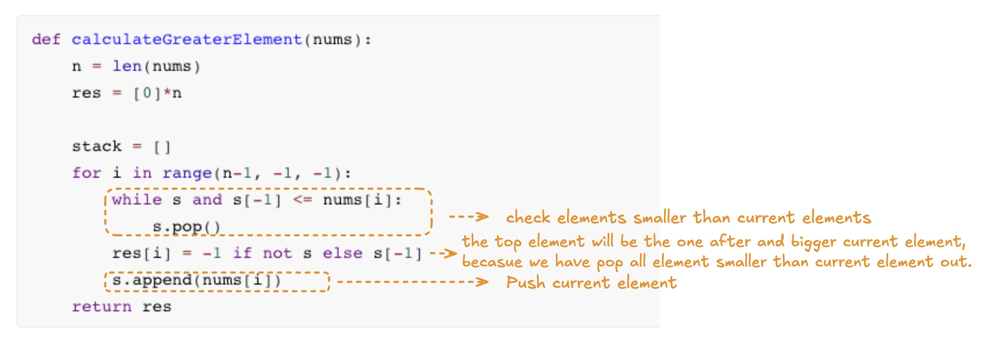

# LeetCode Day 46,47 **Monotone Stack**


**Monotone Stack**: A stack that the elements in the stack are strictly increasing (or decreasing).

**How to implement?** 

- Each time an element come in, pop out all elements in the stack which smaller than the current element. Then push the element in. Therefore, the elements will always decreasing in the stack. 

**Example:** Given an arrray `nums`, return an array, on each index, it store the corresponding next bigger element of the `nums` array, store `-1` if no bigger element found.

`nums = [2,1,2,4,3]`

`res = [4,2,4,-1,-1]`

Broute-Force will result in O(n^2) Time complexity.

**Solution:** Iterate the `nums` array from end to start, 

```python
def calculateGreaterElement(nums):
    n = len(nums)
    res = [0]*n
    
    s = []
    for i in range(n-1, -1, -1):
        while s and s[-1] <= nums[i]:
            s.pop()
        res[i] = -1 if not s else s[-1]
        s.append(nums[i])
    return res
```



If iterate in order, need to push the index in stack, instead of the number. And the result will be updated when the index is out stack.

```python
def calculateGreaterElement2(nums):
    n = len(nums)

    res = [-1]*n
    s = []

    for i in range(len(nums)):
        while s and nums[s[-1]] < nums[i]:
            res[s.pop()] = nums[i]
        s.append(i)
    return res
```


### [739. Daily Temperatures](https://leetcode.com/problems/daily-temperatures)


```python
class Solution:
    def dailyTemperatures(self, temperatures: List[int]) -> List[int]:
        n = len(temperatures)
        res = [0]*n
    
        s = [0]
        for i in range(1, n):
            if temperatures[i] <= temperatures[s[-1]]:
                s.append(i)
            else:
                while s and temperatures[i] > temperatures[s[-1]]:
                    res[s[-1]] = i - s[-1]
                    s.pop()
                s.append(i)
        return res
```


### [496. Next Greater Element I](https://leetcode.com/problems/next-greater-element-i)

Because we have known `nums1` is the subset of `nums2`, we can just do the same thing on `nums2`, for each element, if it exists in `nums1`, then we store the result. 

In essence, we create a mapping, whose keys are each number in `nums2`, values are corresponding to"next greater element". Setting the map by doing what we have learned before. Then iterate `nums1` to fill the result.

```python
class Solution:
    def nextGreaterElement(self, nums1: List[int], nums2: List[int]) -> List[int]:
        result = [-1]*len(nums1)
        s = [0]

        for i in range(1,len(nums2)):
            while s and nums2[i]>nums2[s[-1]]:
                if nums2[s[-1]] in nums1:
                    index = nums1.index(nums2[s[-1]])
                    result[index]=nums2[i]
                s.pop()
            s.append(i)
        return result
```

Time Complexity: O(mn) /O(n^2^)

Improve performance by applying mapping: 

```python
class Solution:
    def nextGreaterElement(self, nums1: List[int], nums2: List[int]) -> List[int]:
        stack = []
        mapping = {}

        for num in nums2:
            while stack and num > stack[-1]:
                mapping[stack.pop()] = num
            stack.append(num)

        # For elements remaining in the stack, they don't have NGE, so assign -1
        while stack:
            mapping[stack.pop()] = -1

        # Build the result list by looking up the mapping for each number in nums1
        return [mapping[num] for num in nums1]
```

Time Complexity: O(m+n) /O(n)


### [503. Next Greater Element II](https://leetcode.com/problems/next-greater-element-ii)

Use `2*n` and `i%n`  to stimulate concat two `nums` list.

```python
class Solution:
    def nextGreaterElements(self, nums: List[int]) -> List[int]:
class Solution:
    def nextGreaterElements(self, nums: List[int]) -> List[int]:
        n = len(nums)
        res = [-1] * n
        s = []

        for i in range(2 * n):
            while s and nums[i%n] > nums[s[-1]]:
                res[s[-1]] = nums[i%n]
                s.pop()
            s.append(i%n)

        return res
```


### [42. Trapping Rain Water](https://leetcode.com/problems/trapping-rain-water)


```python
class Solution:
    def trap(self, height: List[int]) -> int:
        n = len(height)
        res = 0
        s = []

        for i in range(n):
            while s and height[i] > height[s[-1]]:
                mid = s.pop()
                if s:
                    h = min(height[s[-1]], height[i]) - height[mid]
                    w = i - s[-1] - 1
                    res += h * w
            s.append(i)
        return res
```


### [84. Largest Rectangle in Histogram](https://leetcode.com/problems/largest-rectangle-in-histogram)