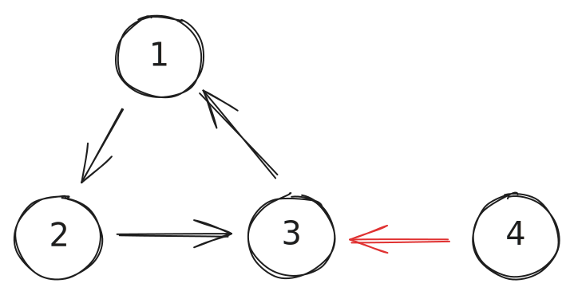
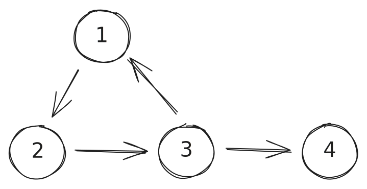

# LeetCode Day 52,53 Graph Union Find

- [Introduction to Disjoint Set (Union-Find Algorithm)](https://www.geeksforgeeks.org/introduction-to-disjoint-set-data-structure-or-union-find-algorithm/)

  Disjoint Set (Union-Find Algorithm)

  *Two sets are called* ***\*disjoint sets\**** *if they don’t have any element in common*

  A data structure that stores non overlapping or disjoint subset of elements is called disjoint set data structure. The disjoint set data structure supports following operations:

  - Adding new sets to the disjoint set.
  - Merging disjoint sets to a single disjoint set using ***\*Union\**** operation.
  - Finding representative of a disjoint set using ***\*Find\**** operation.
  - Check if two sets are disjoint or not. 

  

  ```python
  class UnionFind:
      def __init__(self, n=1000):
          self.father = list(range(n))  # Initialize each node to be its own parent
  
      # Find the root of the set containing u, with path compression
      def find(self, u):
          if u != self.father[u]:
              self.father[u] = self.find(self.father[u])
          return self.father[u]
  
      # Check if two nodes are in the same set
      def is_connected(self, u, v):  # Fixed typo in method name
          return self.find(u) == self.find(v)
  
      # Join the sets containing u and v
      def union(self, u, v):
          root_u = self.find(u)
          root_v = self.find(v)
          if root_u != root_v:
              self.father[self.find(v)] = self.find(u)
  ```

  

  Time Complexity: 

  Find: O(log n) - O(1)


[1971. Find if Path Exists in Graph](https://leetcode.com/problems/find-if-path-exists-in-graph)

```python
class Solution:
    def validPath(self, n: int, edges: List[List[int]], source: int, destination: int) -> bool:
        uf = UnionFind(n)

        for a, b in edges:
            uf.union(a, b)

        return uf.find(source) == uf.find(destination)
```


[684. Redundant Connection](https://leetcode.com/problems/redundant-connection/)


```python
class Solution:
    def findRedundantConnection(self, edges: List[List[int]]) -> List[int]:
        uf = UnionFind(1001)

        for a, b in edges:          
            if uf.is_connected(a, b):
                return [a,b]
            uf.union(a, b)
```


[685. Redundant Connection II](https://leetcode.com/problems/redundant-connection-ii/)

 Compared with last problem, this is set in **directed** graph.

What else, after deletion, the graph need to be a **rooted tree**. For a rooted tree, we need one root, who's in-degree will be 0, and all other node's should have in-degree exactly 1.

Therefore, we come up to several situation:

1. Find a node who's in-degree is 2, delete the later edge pointed to this node.

2. Sometimes, two edges point to a node, but only one of them is valid to be deleted. We need to determine whether delete an edge will end up to a rooted tree. 

   

3. There is no node who's in-degree is 2, it means there is a directed cycle in the graph. Just delete an edge of this cycle.



```python
class UnionFind:
    def __init__(self, n=1000):
        self.father = list(range(n))  # Initialize each node to be its own parent

    # Find the root of the set containing u, with path compression
    def find(self, u):
        if u != self.father[u]:
            self.father[u] = self.find(self.father[u])
        return self.father[u]

    # Check if two nodes are in the same set
    def is_connected(self, u, v):  # Fixed typo in method name
        return self.find(u) == self.find(v)

    # Join the sets containing u and v
    def union(self, u, v):
        root_u = self.find(u)
        root_v = self.find(v)
        if root_u != root_v:
            self.father[self.find(v)] = self.find(u)
    
    def isTreeAfterRemoveEdge(self, edges, edge):
        for u, v in edges:
            if [u,v] == edge: 
                continue
            if self.is_connected(u, v):
                return False
            self.union(u, v)
        return True
    
    def getEdgeToRemove(self, edges):
        for u, v in edges:
            if self.is_connected(u, v):
                return [u, v]
            self.union(u, v)

class Solution:
    def findRedundantDirectedConnection(self, edges: List[List[int]]) -> List[int]:
        uf = UnionFind(1001)
        inDegree = [0]*(len(edges)+1)
        toDelete = []

        for a, b in edges: 
            inDegree[b] += 1
        
        for a, b in edges:
            if inDegree[b] == 2:
                toDelete.append([a,b])

        if len(toDelete) > 0:
            if (uf.isTreeAfterRemoveEdge(edges, toDelete[-1])):
                return toDelete[-1]
            else:
                return toDelete[0]
        
        return uf.getEdgeToRemove(edges)
```

